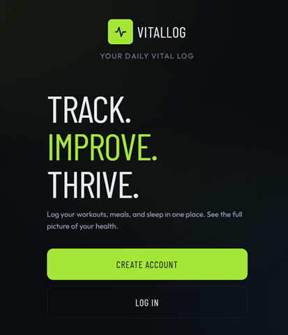
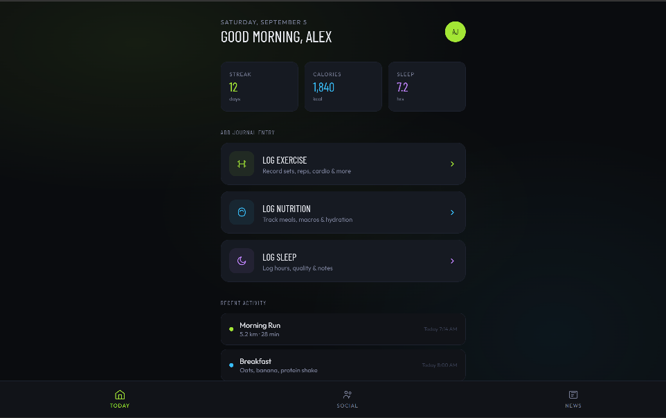
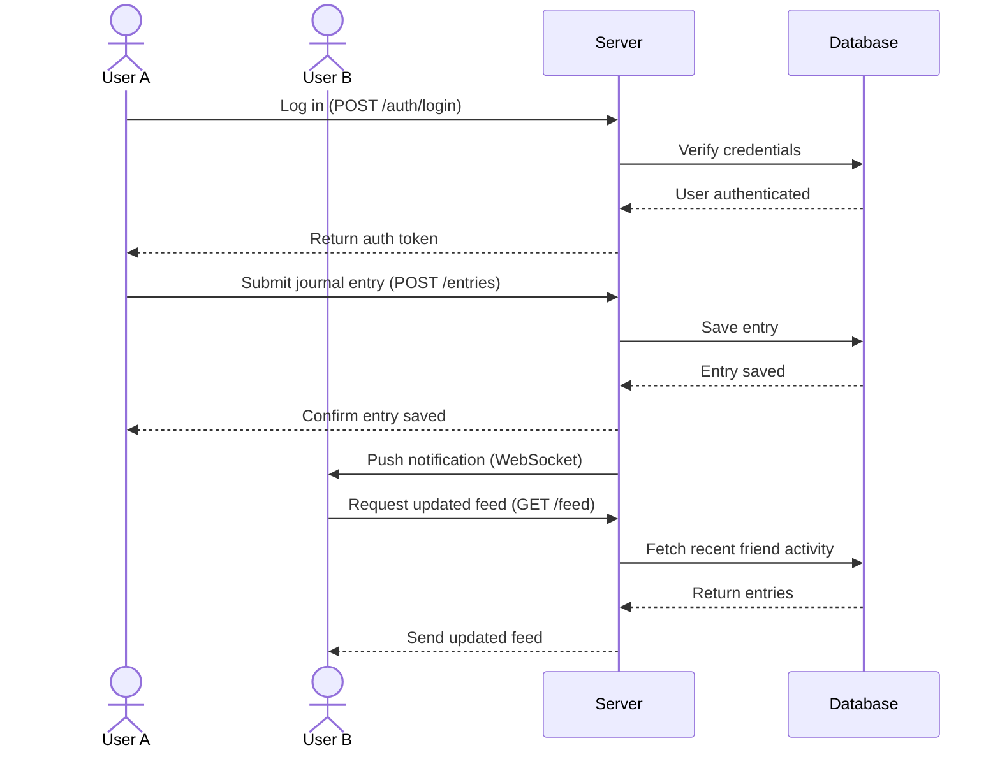

# VitalLog (place holder for now)

[My Notes](notes.md)

VitalLog will be a health and wellness application that allows users to track personal fitness trends, connect with friends, and keep up to date with current nutrition and sports medicine news. Additionally, VitalLog will support user messaging and provide fitness predictions based on current trends in personal health data.

> [!NOTE]
> This is a template for your startup application. You must modify this `README.md` file for each phase of your development. You only need to fill in the section for each deliverable when that deliverable is submitted in Canvas. Without completing the section for a deliverable, the TA will not know what to look for when grading your submission. Feel free to add additional information to each deliverable description, but make sure you at least have the list of rubric items and a description of what you did for each item.

> [!NOTE]
> If you are not familiar with Markdown then you should review the [documentation](https://docs.github.com/en/get-started/writing-on-github/getting-started-with-writing-and-formatting-on-github/basic-writing-and-formatting-syntax) before continuing.

### Elevator pitch

VitalLog helps create lasting healthy habits by making it effortless to log your meals, exercise, and sleep all in one place. Rather than keeping track of fitness journeys on your own, VitalLog allows you to connect with friends and celebrate your progress. In addition, VitalLog will encourage evidence backed practices by providing current news from nutrition and exercise science articles with links to the associated research papers.

### Design

Login and homescreen designs created with *Figma*

### Key features

- Secure login over HTTPS
- Ability to log daily entries for sleep exercise, and nutrition
- Dashboard displaying recent entries and trends over time
- Ability to edit or delete previously logged entries
- Ability to send, accept, and remove friend connections
- Real-time notifications when a friend logs a new entry
- Feed of recent fitness and nutrition science paper headlines with links to original sources
- Entries and connections are persistently stored per user

### Technologies

I am going to use the required technologies in the following ways.

* **HTML** - Uses correct HTML structure for application. Multiple pages/views including login, dashboard, journal entry and article feed.

* **CSS** -  Application styling that looks good on different screen sizes and uses good whitespace, color choice, and contrast.

* **React** - Provides login, journal entry forms, dashboard views, friend feed display, notification bell, and routing between components.

* **Service** - Backend service with endpoints for:
   * login and registration
   * creating, editing, and deleting journal entries
   * sending, accepting, and removing friend connections
   * retrieving friend feed activity
   * retrieving recent science paper headlines

* **DB/Login** -  Store users, journal entries, connections, and articles in a database. Register and login users. Credentials securely stored in database. 

* **WebSocket** - As a user logs a new entry, friends connected to them receive a real-time notification, and the friend feed updates live without needing a page refresh.

* **3rd Party API** - I will use the [PubMed API](https://www.ncbi.nlm.nih.gov/home/develop/api/) (via NCBI's E-utilities) to retrieve recent nutrition and exercise science research headlines. My backend service will periodically query the API for recent articles matching relevant search terms, store simplified results (title, authors, publish date, and link) in my `articles` collection, and serve them to the frontend feed.

## 🚀 Specification Deliverable

> [!NOTE]
> Fill in this sections as the submission artifact for this deliverable. You can refer to this [example](https://github.com/webprogramming260/startup-example/blob/main/README.md) for inspiration.

For this deliverable I did the following. I checked the box `[x]` and added a description for things I completed.

- [x] I completed the prerequisites for this deliverable (Git commit requirement) - Created my GitHub repo, cloned it locally, and made my initial commits following the required Git setup.
- [x] Proper use of Markdown - Used headers, bullet lists, bold text, images, and a fenced Mermaid diagram to structure this README.
- [x] A concise and compelling elevator pitch - Wrote a short pitch describing VitalLog's purpose and core value.
- [x] Description of key features - Listed the key features my application will support.
- [x] Description of how you will use each technology including your 3rd party API and use of WebSocket - Described how I will use HTML, CSS, React, Service, DB/Login, WebSocket, and the PubMed 3rd party API.
- [x] One or more rough sketches of your application. Images must be embedded in this file using Markdown image references. - Embedded my Figma login and homescreen designs as images.Markdown image references.

## 🚀 AWS deliverable

For this deliverable I did the following. I checked the box `[x]` and added a description for things I completed.

- [ ] **Rented EC2 server** - I did not complete this part of the deliverable.
- [ ] **Leased domain name** - I did not complete this part of the deliverable.
- [ ] **Server accessible** from my domain: [https://yourdomainnamehere.click](https://yourdomainnamehere.click) - I did not complete this part of the deliverable.

## 🚀 HTML deliverable

For this deliverable I did the following. I checked the box `[x]` and added a description for things I completed.

- [ ] I completed the prerequisites for this deliverable (Simon deployed, GitHub link, Git commits)
- [ ] **HTML pages** - I did not complete this part of the deliverable.
- [ ] **Proper HTML element usage** - I did not complete this part of the deliverable.
- [ ] **Links** - I did not complete this part of the deliverable.
- [ ] **Text** - I did not complete this part of the deliverable.
- [ ] **3rd party API placeholder** - I did not complete this part of the deliverable.
- [ ] **Images** - I did not complete this part of the deliverable.
- [ ] **Login placeholder** - I did not complete this part of the deliverable.
- [ ] **DB data placeholder** - I did not complete this part of the deliverable.
- [ ] **WebSocket placeholder** - I did not complete this part of the deliverable.

## 🚀 CSS deliverable

For this deliverable I did the following. I checked the box `[x]` and added a description for things I completed.

- [ ] I completed the prerequisites for this deliverable (Simon deployed, GitHub link, Git commits)
- [ ] **Visually appealing colors and layout. No overflowing elements.** - I did not complete this part of the deliverable.
- [ ] **Use of a CSS framework** - I did not complete this part of the deliverable.
- [ ] **All visual elements styled using CSS** - I did not complete this part of the deliverable.
- [ ] **Responsive to window resizing using flexbox and/or grid display** - I did not complete this part of the deliverable.
- [ ] **Use of a imported font** - I did not complete this part of the deliverable.
- [ ] **Use of different types of selectors including element, class, ID, and pseudo selectors** - I did not complete this part of the deliverable.

## 🚀 React part 1: Routing deliverable

For this deliverable I did the following. I checked the box `[x]` and added a description for things I completed.

- [ ] I completed the prerequisites for this deliverable (Simon deployed, GitHub link, Git commits)
- [ ] **Bundled using Vite** - I did not complete this part of the deliverable.
- [ ] **Components** - I did not complete this part of the deliverable.
- [ ] **Router** - I did not complete this part of the deliverable.

## 🚀 React part 2: Reactivity deliverable

For this deliverable I did the following. I checked the box `[x]` and added a description for things I completed.

- [ ] I completed the prerequisites for this deliverable (Simon deployed, GitHub link, Git commits)
- [ ] **All functionality implemented or mocked out** - I did not complete this part of the deliverable.
- [ ] **Hooks** - I did not complete this part of the deliverable.

## 🚀 Service deliverable

For this deliverable I did the following. I checked the box `[x]` and added a description for things I completed.

- [ ] I completed the prerequisites for this deliverable (Simon deployed, GitHub link, Git commits)
- [ ] **Node.js/Express HTTP service** - I did not complete this part of the deliverable.
- [ ] **Static middleware for frontend** - I did not complete this part of the deliverable.
- [ ] **Calls to third party endpoints** - I did not complete this part of the deliverable.
- [ ] **Backend service endpoints** - I did not complete this part of the deliverable.
- [ ] **Frontend calls service endpoints** - I did not complete this part of the deliverable.
- [ ] **Supports registration, login, logout, and restricted endpoint** - I did not complete this part of the deliverable.
- [ ] **Uses BCrypt to hash passwords** - I did not complete this part of the deliverable.

## 🚀 DB deliverable

For this deliverable I did the following. I checked the box `[x]` and added a description for things I completed.

- [ ] I completed the prerequisites for this deliverable (Simon deployed, GitHub link, Git commits)
- [ ] **Stores data in MongoDB** - I did not complete this part of the deliverable.
- [ ] **Stores credentials in MongoDB** - I did not complete this part of the deliverable.

## 🚀 WebSocket deliverable

For this deliverable I did the following. I checked the box `[x]` and added a description for things I completed.

- [ ] I completed the prerequisites for this deliverable (Simon deployed, GitHub link, Git commits)
- [ ] **Backend listens for WebSocket connection** - I did not complete this part of the deliverable.
- [ ] **Frontend makes WebSocket connection** - I did not complete this part of the deliverable.
- [ ] **Data sent over WebSocket connection** - I did not complete this part of the deliverable.
- [ ] **WebSocket data displayed** - I did not complete this part of the deliverable.
- [ ] **Application is fully functional** - I did not complete this part of the deliverable.
